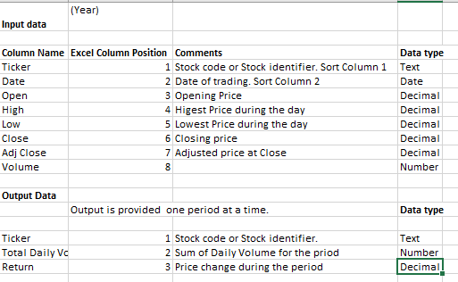

# Module 2 Visual Basic for Applications - Analyze Stock Data

## Overview of Project
### Background
Analyze stocks data in order to make decision about future investmenst. The data received is the green energy stock data from 2017 and 2018.
The porject uses VBA to automate stock analysis. The dataset used in this analysis can be downloaded from [Green Energy stock data](https://2u-data-curriculum-team.s3.amazonaws.com/dataviz-online/module_2/green_stocks.xlsx)
The stcok's perormance is evaluated using 2 metrics.
  1. Total Daily Volumns = Total stocks traded in a year
  2. Return = Stock price changes over a year. (Closing price at the end of the year / closing price at the start of year) -1 

#### Data Defintions

       
       
### Purpose
Use VBA to automate the stock analysis. The analysis requirements are:
  1. Provide output in a new sheet named "All Stock Analysis"
  2. Provide 2 buttons in the new sheet as follows:
      1. Run Analysis for all stocks: This button writes the output of stock analysis (Ticket, Total Daily Volumn, and Return) to All stock analysis andbeformat it.
      2. Clear Worksheet: Clear the content of current worksheet "All Stock analysis"
  3. Allow user to input the sheet name where data is available. So that user can run for any period of stock data.
  4. The output contains following information: (see [Data Defintions](https://github.com/asyed9394/UofTSCS_DA_BC_2020_21_Stock_Analysis/blob/main/README.md#data-defintions) ) 
      1. Tikcer 
      2. Total Daily Volumn
      3. Return 
  5. Optimzed the code to run for a large number of data set.  
  
## Results

### version 1.0

  1. First version of the VBA code build during the module 2 learning. The code acheived all requirements provided in the [Purpose]((https://github.com/asyed9394/UofTSCS_DA_BC_2020_21_Stock_Analysis/blob/main/Purpose] on samll data set provided in the Energy stock data from 2017 and 2018.
  2. The run time for 2017 was 0.890625 sec
    [Run time for 2017 totals before code refactoring]
    (Resources/Before_Refactoring_2017_All_Stock_Analysis.png)
  3. The run time for 2018 was 0.9453125 sec
    [Run time for 2018 totals before code refactoring]
    (Resources/Before_Refactoring_2018_All_Stock_Analysis.png)
    
 

