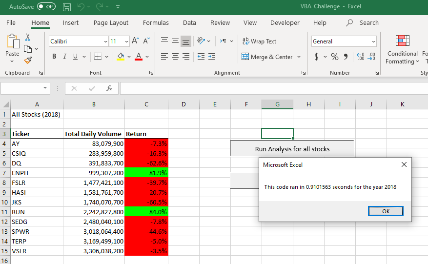

# Module 2 Visual Basic for Applications - Analyze Stock Data

## Overview of Project:
### Background:
Analyze stocks data in order to make decision about future investmenst. The data received is the green energy stock data from 2017 and 2018.
The porject uses VBA to automate stock analysis. The dataset used in this analysis can be downloaded from [Green Energy stock data](https://2u-data-curriculum- team.s3.amazonaws.com/dataviz-online/module_2/green_stocks.xlsx)
The stcok's perormance is evaluated using 2 metrics.
   1. Total Daily Volumns = Total stocks traded in a year
   2. Return = Stock price changes over a year. (Closing price at the end of the year / closing price at the start of year) -1 

#### Data Defintions

  
       
     
### Purpose:
Use VBA to automate the stock analysis. The analysis requirements are:
    1. Provide output in a new sheet named "All Stock Analysis"
    2. Provide 2 buttons in the new sheet as follows:
        1. Run Analysis for all stocks: This button writes the output of stock analysis (Ticket, Total Daily Volumn, and Return) to All stock analysis andbeformat it.
        2. Clear Worksheet: Clear the content of current worksheet "All Stock analysis"
    3. Allow user to input the sheet name where data is available. So that user can run for any period of stock data.
    4. The output contains following information: (see [Data Defintions](https://github.com/asyed9394/UofTSCS_DA_BC_2020_21_Stock_Analysis/blob/main/README.md#data-defintions) ) 
        1. Tikcer 
        2. Total Daily Volumn
        3. Return 
    5. Optimzed the code to run for a large number of data set.  
  
## Results:

### VBA Code Version 1.0 Before refactoring:

Link to the version 1.0 of the code: [Stock Analaysis VBA Code Version 1.0 before refactoring](Resources/VBA_Challenge_Before_Refactored.vbs)
    1. First version of the VBA code build during the module 2 learning. The code acheived all requirements provided in the [Purpose](https://github.com/asyed9394/UofTSCS_DA_BC_2020_21_Stock_Analysis/blob/main/Purpose) on samll data set provided in the Energy stock data from 2017 and 2018.
    
   2. The run time for 2017 was 0.9414063 sec:
  
  
  
   3. The run time for 2018 was 0.9101563 sec. 
  
  
    
### VBA Code Version 2.0 Aefore refactoring:

Link to the version 2.0 of the code: [Stock Analaysis VBA Code Version 2.0 after refactoring](Resources/VBA_Challenge_Refactored_Script.vbs)

   1. First version of the VBA code build during the module 2 learning. The code acheived all requirements provided in the [Purpose](https://github.com/asyed9394/UofTSCS_DA_BC_2020_21_Stock_Analysis/blob/main/Purpose) on samll data set provided in the Energy stock data from 2017 and 2018. It also included refactoring to increase the run time and optimized for larger data set.
  
  2. The run time for 2017 was 0.7109375 sec:
  
  
  
  3. The run time for 2018 was 0.7734375 sec. 
  
  

There is approximately 15%-25% reduction in run. So while the amount looks so small for data used in the analysis, but when applied to a larger data set we will see the benefits of refactoring the code.

## Summary:

### General Advantage of code refactoring:

Refactoring is an importnat part of any coding process. Refactoring doesn't mean that a new functionality is added, but it is to make the code more effcient. The effecincy c   could be to reduce run time, reduce the cost of running code or make it easy for future enahcnements. The run time reduction could be achieve by using fewer steps, while cost  reduciton could be achieve by less steps as well as using less memory. In addition we can make the logic within the code simpler and add comments to make it easier for future  changes.
These types of refactoring depend on underlying architecture and optimal use of the application. In case of VBA codes, we can achieve better run time by reducing steps, slecting the approprate data type for variables and the logic used within the code.

### Code refactoring for Stock analysis:

  As explained in [Results](https://github.com/asyed9394/UofTSCS_DA_BC_2020_21_Stock_Analysis/blob/main/Results) section , The run time improved 15% for 2018 and 25% for 2017 stock data. So by refactoring we've reduced the runtime of the stock analysis. 
  
 While I don't have any specific disadvatnage for refactoring, overall I noticed following things about the solution that should be taken into account.
 
  1. The code assumes that data is already sorted on the Ticker and date columns, so the logic to pick starting price and ending price can work properly. If data is not sorted then the code will give us wrong output.
  2. The code also assume the data comes in input format sepecified as in [Data Defintions](https://github.com/asyed9394/UofTSCS_DA_BC_2020_21_Stock_Analysis/blob/main/README.md#data-defintions) . If the code doesn't meet these specific requirements then output will not be accurate.
  3. The input box doesn't work if user change their mind and Click on the cancel. This happend becuase code deosn't account for this user input behavior and end up with an error rather than exiting the process.
 
 
  

